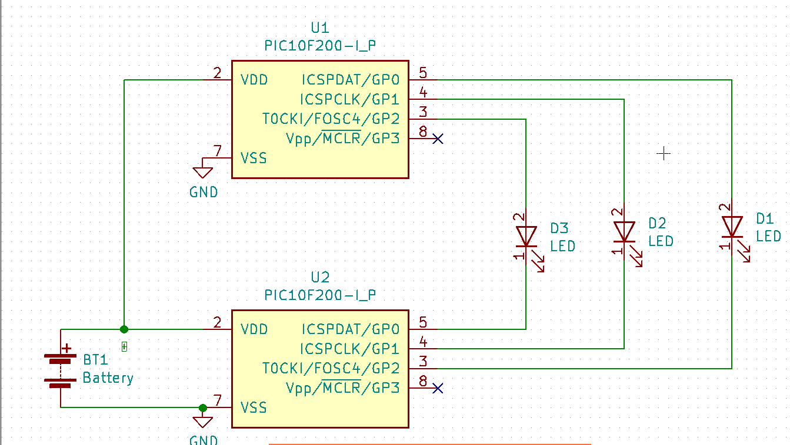

3 LEDs fading
==============

This is a demonstration of LED fading effect without using PWM ramping duty cycle.  In this demo 2 PIC1F200 are use as binary counters outputing the count on GPIO.
3 LEDs are connected between corresponding GPx of the two MCU. Because the internal oscillator of each MCU are not at exactly the same frequency. The count on the
I/O pins phase shift gradually producing a fade in, fade out effect.

The only components required are

1. 2 PIC10F200
1. 3 LEDs

Both MCU run the same code which is only 14 instructions.

<pre><code>
    include p10f200.inc
    
    __config  _WDTE_OFF
    
    udata
cntr res 1
 
    org 0
    ; set GP0,GP1,GP2 as output
    movlw 0
    tris GPIO
    ; set TMR0 with 1:4 pre-scale
    movlw 2|1<<7
    option
    
loop
    incf cntr,F
    movfw cntr
    ; output binary count to GPIO
    movwf GPIO
    ; delay ~ 1msec
    movfw TMR0
    skpz
    goto $-2
    goto loop
    
    end

</code></pre>

LED D1 is the fastest, D2 pulse at half D1 rate and D3 pulse at 1/4 D1 rate.

